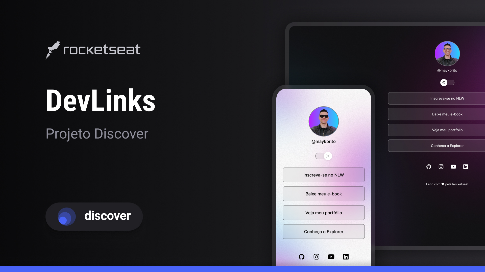

<h1 align="center"> DevLinks </h1>

DevLinks é um projeto desenvolvido durante o curso Discover da Rocketseat. É um agregador de links que funciona como um cartão de visita online para desenvolvedores, permitindo compartilhar informações importantes e úteis sobre você e seus projetos. Esta versão foi adaptada para uso pessoal, proporcionando uma maneira fácil de compartilhar seus links e informações online.  

  <a href="#-tecnologias">Tecnologias</a>&nbsp;&nbsp;&nbsp;|&nbsp;&nbsp;&nbsp;
  <a href="#-projeto">Projeto</a>&nbsp;&nbsp;&nbsp;|&nbsp;&nbsp;&nbsp;
  <a href="#memo-licença">Licença</a>

  

 

## 🚀 Tecnologias

Esse projeto foi desenvolvido com as seguintes tecnologias:

- HTML e CSS
- JavaScript
- Git e Github
- Figma

## 💻 Projeto

O DevLinks é um agregador de links para usar como cartão de visitas online.

- [Acesse o projeto finalizado e personalizado](https://kimberllyatanazio.github.io/projeto-discover/)
- [Estude este projeto](https://www.rocketseat.com.br/discover)

Se você estiver interessado em aprender como criar algo semelhante, recomendo assistir às aulas disponíveis no link acima.

## :memo: Licença

Esse projeto está sob a licença MIT.

---